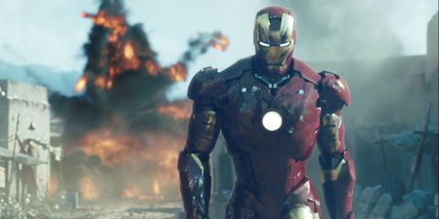

# Superhero

- In the **MCU** the most `intelligent` superhero is _IRON MAN_

---

<center>

# IRON-MAN



One of my favourite superheroes.
Robert Downey Jr acts as Iron man in the MCU.

</center>

```json
{
  "firstName": "Robert",
  "lastName": "Downey Jr.",
  "age": 62
}
```

- acted in the iron man movie series
  - set of three individual superhero movie
- acted in the avengers series
  - set of 4 multiple superhero movies
- acted in spiderman homecoming
- acted in captain america civil war
- acted in the incredible hulk

## About

1. See [MCU -Wikipedia](https://en.wikipedia.org/wiki/Marvel_Cinematic_Universe)
1. See [Iron-man WIkipedia](https://en.wikipedia.org/wiki/Iron_Man)
1. See [Iron-man movie series-IMDB](https://www.imdb.com/list/ls066607305/)
1. See [Robert Downey Jr-Wikipedia](https://en.wikipedia.org/wiki/Robert_Downey_Jr.)

## Introduction of plot

### Iron man 1

> A wealthy American business magnate, playboy, and ingenious scientist, Anthony Edward "Tony" Stark suffers a severe chest injury during a kidnapping. When his captors attempt to force him to build a weapon of mass destruction, he instead creates a powered suit of armor to save his life and escape captivity. Later, Stark develops his suit, adding weapons and other technological devices he designed through his company, Stark Industries. He uses the suit and successive versions to protect the world as Iron Man.

### Avengers

- [x] Create or find a problem which nowhere exists
- [ ] Try to solve the problem
- [ ] Fix it at last

> ~~The world is in danger.~~ We now know that the world will be saved.

> # quotes
>
> > "Don't do anything I would do, and definitely don't do anything I wouldn't do..."
> >
> > > _Sometimes you gotta run before you walk._

## More on the movie franchise

| Movie                      | LINK                                                                  |
| -------------------------- | --------------------------------------------------------------------- |
| Iron man 2008              | [wikipedia](<https://en.wikipedia.org/wiki/Iron_Man_(2008_film)>)     |
| Iron man 2010              | [wikipedia](https://en.wikipedia.org/wiki/Iron_Man_2)                 |
| Iron man 2013              | [wikipedia](https://en.wikipedia.org/wiki/Iron_Man_3)                 |
| Marvel's The Avengers      | [wikipedia](<https://en.wikipedia.org/wiki/The_Avengers_(2012_film)>) |
| Avengers: Age of Ultron    | [wikipedia](https://en.wikipedia.org/wiki/Avengers:_Age_of_Ultron)    |
| Avengers: Infinity War     | [wikipedia](https://en.wikipedia.org/wiki/Avengers:_Infinity_War)     |
| Avengers: Endgame          | [wikipedia](https://en.wikipedia.org/wiki/Avengers:_Endgame)          |
| Spider-Man: Homecoming     | [wikipedia](https://en.wikipedia.org/wiki/Spider-Man:_Homecoming)     |
| Captain America: Civil War | [wikipedia](https://en.wikipedia.org/wiki/Captain_America:_Civil_War) |

<center>

| Sl.no |    Name    | Year |
| :---- | :--------: | ---: |
| 1.    |  Iron man  | 2008 |
| 2.    | Iron man 2 | 2010 |
| 3.    | Iron man 3 | 2013 |

</center>

---

## HTML

```html
<html>
  <head>
    <title>
      IRON MAN
    </title>

    <style>
      #bodya {
        text-align: center;
      }

      #ironmanlike {
        color: white;
        padding: 10px;
        background-color: dodgerblue;
        border-radius: 10px;
        border-collapse: collapse;
      }
    </style>
  </head>

  <body>
    <div id="bodya">
      <button id="ironmanlike">Like IRON MAN</button>
    </div>
    <script></script>
  </body>
</html>
```

<html>
<head>

<title>
IRON MAN
</title>

<style>

#bodya{
text-align:center;
}

#ironmanlike{
color:white;
padding:10px;
background-color:dodgerblue;
border-radius:10px;
border-collapse:collapse;
}

</style>

</head>

<body>
<div id='bodya'>
<button id='ironmanlike'>Like IRON MAN</button>
</div>
<script>

</script>
</body>
</html>

# Finally

<center>

```sh
I, 'am Iron-man
```

</center>
